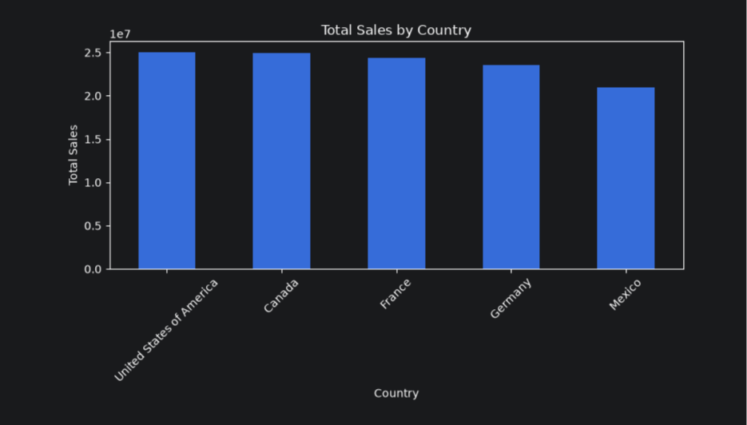
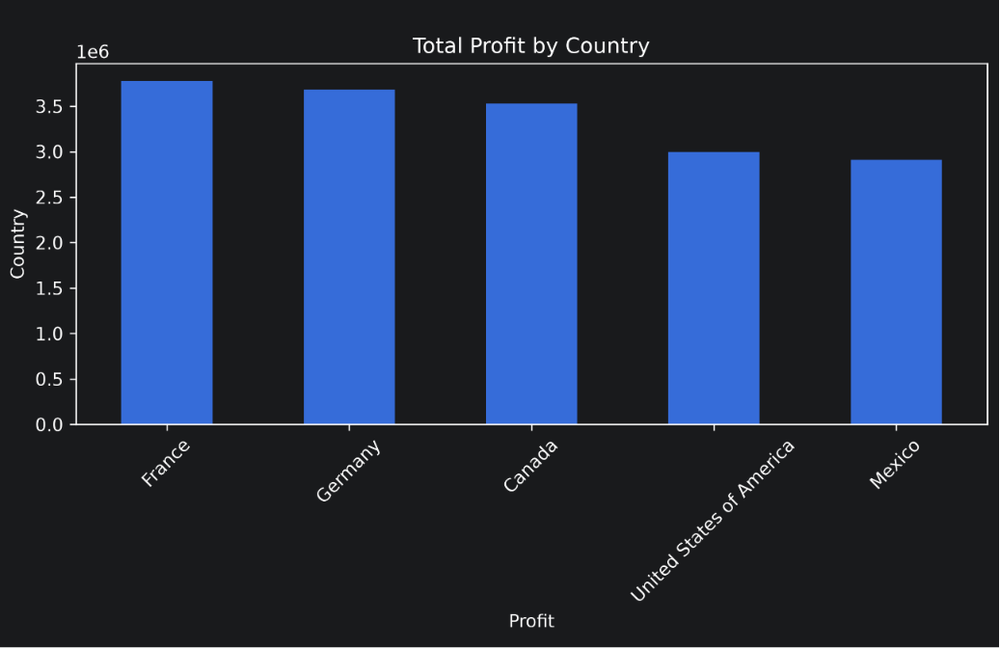
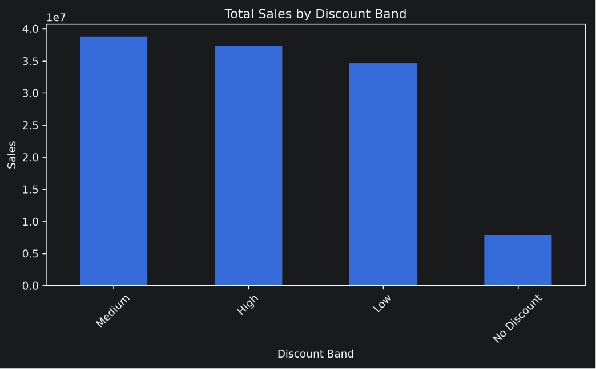
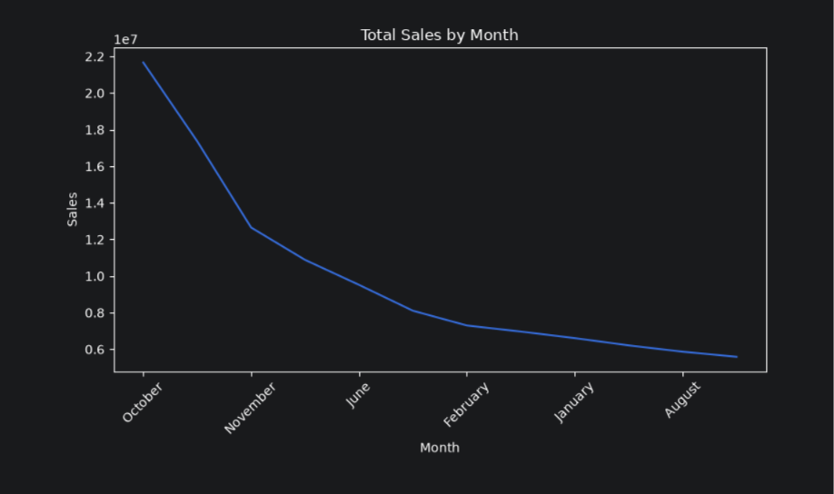
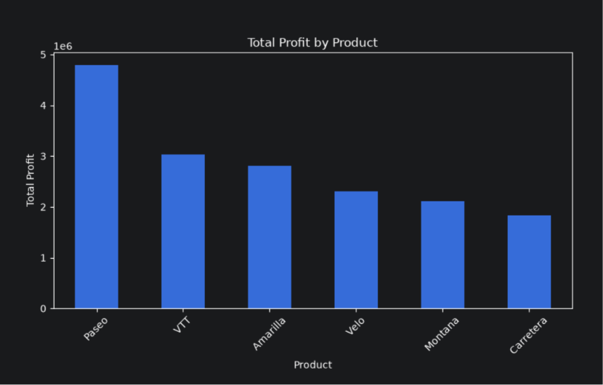
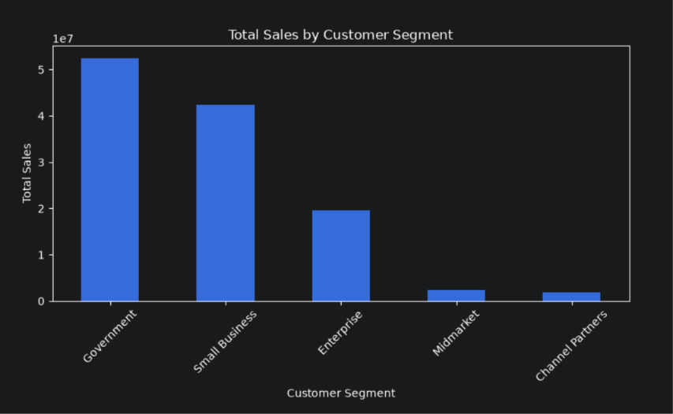
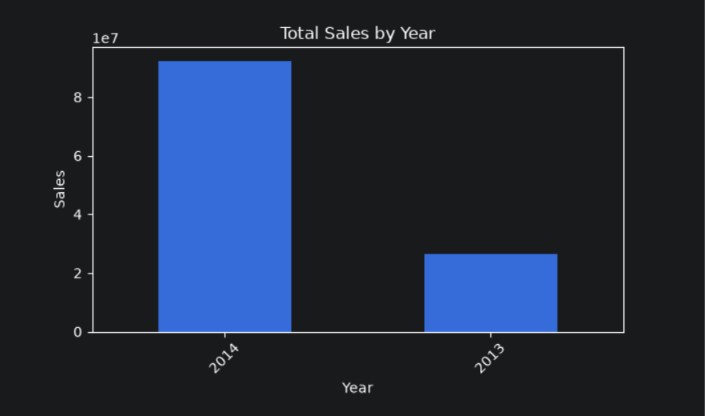
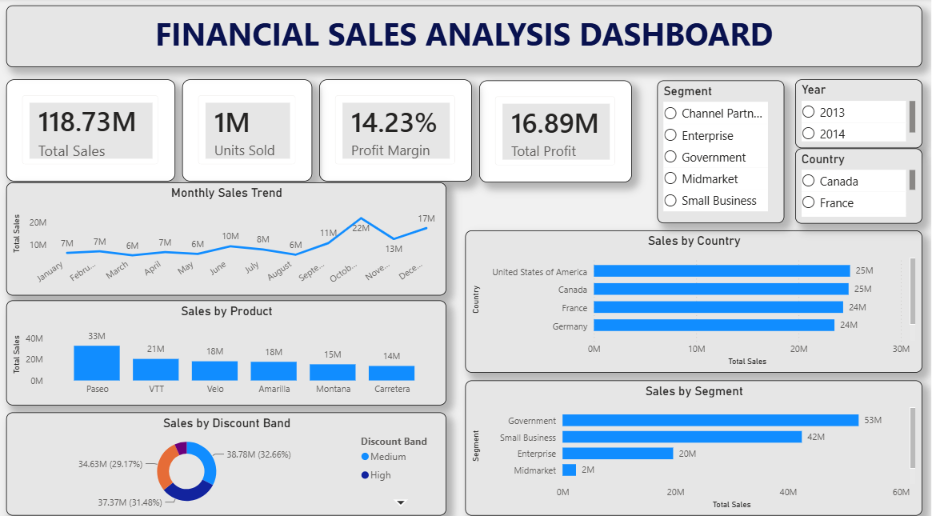

# 📊 Financial Sales Analysis

> An End-to-End Data Analytics Project using **Python, SQL, Machine Learning, and Power BI** to analyze financial sales data, uncover business insights, build a predictive model, and create an interactive dashboard.

---
## 📄 Project Report

The complete project report is available here:

- [My_Stakeholder_Report.pdf](../../Downloads/My_Stakeholder_Report.pdf)

## 📌 Project Overview

This project demonstrates a complete data analytics workflow, starting from raw financial sales data and ending with an interactive Power BI dashboard. The project includes:

- Data Cleaning & Preprocessing
- Exploratory Data Analysis (EDA)
- SQL Business Analysis
- Linear Regression Model
- Interactive Power BI Dashboard
- Business Insights & Recommendations

---

## 🎯 Project Objectives

- Clean and prepare raw financial sales data.
- Analyze sales performance across countries, products, and customer segments.
- Identify sales trends and discount impact.
- Predict sales using a Linear Regression model.
- Build an interactive dashboard for business decision-making.

---

## 🛠️ Tools & Technologies

| Category | Tools |
|----------|-------|
| Programming Language | Python |
| Libraries | Pandas, NumPy, Matplotlib, Scikit-learn |
| Database | MySQL |
| Data Visualization | Power BI |
| Notebook | Jupyter Notebook |
| Version Control | Git & GitHub |

---

## 📂 Project Structure

```text
Financial_Sales_Analysis/
│
├── data/
├── notebooks/
├── outputs/
│   └── charts/
├── dashboard/
│   └── Financial_Sales_Dashboard.pbix
├── report/
│   └── Financial_Sales_Analysis_Report.pdf
├── scripts/
│   └── sales_analysis.sql
├── README.md
├── requirements.txt
└── .gitignore
```

---

## 📊 Dataset Information

| Attribute | Details |
|-----------|----------|
| Dataset | Financial Sales Dataset |
| Rows | 700 |
| Columns | 16 |
| File Type | Excel (.xlsx) |

### Important Features

- Country
- Product
- Segment
- Sales
- Profit
- Gross Sales
- Discounts
- Units Sold
- Manufacturing Price
- Sale Price
- Discount Band
- Date

---

# 🧹 Data Cleaning

The following preprocessing steps were performed:

- Checked missing values
- Filled missing values in **Discount Band**
- Removed extra spaces from column names
- Created **Month Name** and **Month Number**
- Exported cleaned dataset for SQL and Power BI

---

# 📈 Exploratory Data Analysis (EDA)

The following business questions were analyzed:

- Which country generated the highest sales?
- Which product generated the highest sales?
- Which customer segment generated the highest sales?
- Monthly sales trend analysis
- Sales by discount band
- Country-wise profit analysis
- Product-wise profit analysis

---

## 📷 EDA Visualizations










---

# 🤖 Machine Learning

### Model

- Linear Regression

### Features

- Units Sold
- Manufacturing Price
- Sale Price

### Target

- Sales

### Model Performance

| Metric | Value |
|---------|--------|
| R² Score | 0.7623 |
| MAE | 83,644.48 |
| MSE | 13,162,352,455.77 |

---

# 🗄 SQL Analysis

Business questions answered using MySQL:

- Total Sales
- Total Profit
- Highest Sales by Country
- Highest Sales by Segment
- Highest Sales by Product
- Highest Sales Month
- Highest Sales Year
- Average Profit by Country
- Top 10 Sales Transactions
- Highest Sales by Discount Band
- Profit Margin
- Top 5 Profitable Products
- Average Sales by Segment

---

# 📊 Power BI Dashboard

The dashboard includes:

- KPI Cards
- Monthly Sales Trend
- Sales by Country
- Sales by Product
- Sales by Segment
- Sales by Discount Band
- Interactive Slicers

### Dashboard Preview



---

# 💡 Key Insights

- Government segment generated the highest sales.
- Paseo was the highest-selling product.
- United States recorded the highest total sales.
- Profit Margin was approximately **14.23%**.
- October recorded the highest monthly sales.
- Medium and High discount bands contributed significantly to total sales.

---

# 📌 Recommendations

- Increase focus on high-performing products.
- Expand sales strategies in top-performing countries.
- Optimize discount strategies to improve profitability.
- Use monthly trends for inventory and demand planning.

---

# 🚀 Future Improvements

- Add Sales Forecasting using Time Series models.
- Deploy the dashboard using Power BI Service.
- Build an interactive web application with Streamlit.
- Integrate real-time sales data.

---


---

# 👨‍💻 Author

**Mukul Dev**

- 🔗 GitHub: https://github.com/mukuldev54856-ui

- 💼 LinkedIn: https://www.linkedin.com/in/mukul-dev-706925373/

---

# ⭐ If you found this project useful

Please consider giving it a ⭐ on GitHub!
